#  A TraceViz tool

This distribution includes an example TraceViz tool, ['LogViz'](../logviz/),
which features a Go backend and an Angular frontend.  Here, we'll show the
architecture of a typical TraceViz tool using LogViz as an example.  Note that
very little of this architecture is mandatory; the right design for your tool
may be quite different.

Here's a block diagram of LogViz's architecture:

```mermaid
flowchart TD

  classDef tool_service fill:#aa0000
  classDef analysis_library fill:#aa8500
  classDef data_source fill:#aaaa00
  classDef traceviz fill:#006600
  classDef tool_client fill:#000088
  classDef user fill:#300060

  subgraph Architecture
    direction TB

    store[("Profile storage")]:::tool_service
    instantiation("Profile instantiation"):::analysis_library
    lru[("LRU cache")]:::tool_service
    profile[("Profile")]:::analysis_library
    dataSource("Data source"):::data_source
    platform("TraceViz platform"):::traceviz
    toolService("Tool service"):::tool_service
    toolClient("Tool client"):::tool_client
    user("Tool user"):::user

    store -- Fetch raw profile --> instantiation
    lru -- Load missing profile--> store
    instantiation --> lru
    lru --> profile
    profile -- Query profile --> dataSource
    dataSource -- Fetch instantiated profile --> profile
    platform -- Data query --> dataSource
    dataSource -- Data response --> platform
    toolService -- Data query --> platform
    toolClient -- Data query --> toolService
    toolClient -- Request client --> toolService
    user -- Perform interaction --> toolClient
    user -- Load client --> toolClient
  end

  subgraph Key
    direction LR

    label1("Tool service"):::tool_service
    label2("Analysis library"):::analysis_library
    label3("Data source"):::data_source
    label4("TraceViz platform"):::traceviz 
    label5("Tool client"):::tool_client
    label6("User"):::user
  end
```



All [analysis workflows](./why_traceviz.md#analysis-workflows) begin and end
with the user, so we will, too.  A tool user interacts with a tool in two ways:
**loading the tool client** and **interacting with the client**.

Let's start with loading the client.  LogViz, like any web application, consists
of a backend server and a frontend client.  The server awaits HTTP requests on a
specified port, and serves responses for them.  When a user first connects to
the server's port, the server serves the entire tool client as a static bundle
of HTML, JavaScript, and CSS.  This is done in
[`server.go`](../logviz/server/server.go) with:

```go
mux := http.DefaultServeMux
mux.Handle("/", http.FileServer(http.Dir("")))
```

which returns the client bundle on a request to endpoint`/`.

Fetching static assets isn't enough, though.  We also need to get profile data
into the tool, and support user interactions.  The server is also listening for
*dynamic data requests*.  TraceViz's [`QueryHandler`](../server/go/handlers/query_handler.go)
and [`QueryDispatcher`](../server/go/query_dispatcher/) types take care of this
plumbing; from [`service.go`](../logviz/service/service.go):

```go
qd, err := querydispatcher.New(ds)
if err != nil {
  return nil, err
}
/* Elided code */
return &Service{
  queryHandler: handlers.NewQueryHandler(qd),
}
```

where `ds` is a **TraceViz DataSource** implementation:

```go
cf, err := newCollectionFetcher(collectionRoot, cap)
if err != nil {
  return nil, err
}
ds, err := datasource.New(cf)
if err != nil {
  return nil, err
}
```

Any TraceViz backend code that can satisfy frontend queries must implement
`DataSource`, defined in [`QueryDispatcher`](../server/go/query_dispatcher/).
This interface includes only two methods: `SupportedDataSeriesQueries()`, which
returns a list of all queries that data source can satisfy, and
`HandleDataSeriesRequests()`, which accepts a set of requests on those supported
queries and computes their responses in the form of
[low-semantic visualization data](./why_traceviz.md#high-semantic-and-low-semantic-data).
[`querydispatcher.New`](../server/go/query_dispatcher/) can accept multiple data
sources, which means that the same visualization can draw from completely
disjoint data sources.  This is an important feature, since
[analysis workflows](./why_traceviz.md#analysis-workflows) frequently draw from
multiple kinds of profile data.

[The LogViz server](../logviz/server/server.go) instantiates a LogViz service,
which assembles the LogViz query dispatcher, and then registers the TraceViz
data queries:

```go
	service, err := service.New(*resourceRoot, *logRoot, 10)
	if err != nil {
		log.Fatalf(logger.Fatal("Failed to create LogViz service: %s", err))
	}
	service.RegisterHandlers(mux)
```

With that, data requests from the frontend will automatically be batched
together, debounced, and routed to the proper data source: TraceViz handles all
client-server communication for you.

LogViz operates on individual log files found in the filesystem.  Rather than
reloading the same file for each new data query, LogViz stores loaded and
processed [`LogTrace`](../logviz/analysis/log_trace/log_trace.go) profile
instances in a  
[least-recently-used (LRU)](https://en.wikipedia.org/wiki/Cache_replacement_policies#Least_recently_used_(LRU))
cache.  When a log file is requested for the first time, the file is fetched
from the filesystem, processed into a `LogTrace` instance, and stored in the
LRU cache; the next time a query on this file is requested, it can be quickly
satisfied from the cached instance.  This strategy ensures good performance
under TraceViz's stateless protocol.

Whether the requested file was already present in the cache, or needed to be
loaded, user data requests are then satisfied by the
[LogViz data source](../logviz/data_source/data_source.go).  For each group of
data series queries, this data source fetches the requested `LogTrace`
instance, queries it, and marshals low-semantic visualization data in response.
This response data is then sent back to the client and routed to the right
UI components, which then render it.
